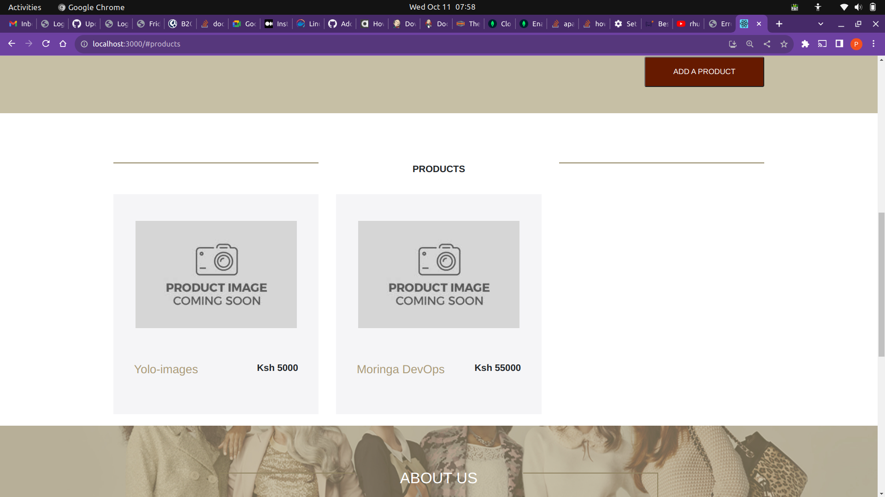

## How to Use

1. **Prerequisites:**
   - Ensure you have Docker and Docker Compose installed on your system.

2. **Clone the YOLO App Repository:**
   - Use the following command to clone the YOLO App repository to your local machine:

     ```shell
     git clone https://github.com/pharesd/yolo.git
     ```

3. **Navigate to the Project Directory:**
   - Change your current working directory to the YOLO App project folder:

     ```shell
     cd yolo
     ```

4. **Start the Services:**
   - Run the following command to start the YOLO App services in the background:

     ```shell
     docker-compose up -d
     ```

5. **Access the YOLO App:**
   - Open your web browser and visit [http://localhost:3000](http://localhost:3000) to access the YOLO App.

6. **Enjoy Your YOLO App:**
   - You're all set! Start using the YOLO App in your local development environment.

   


